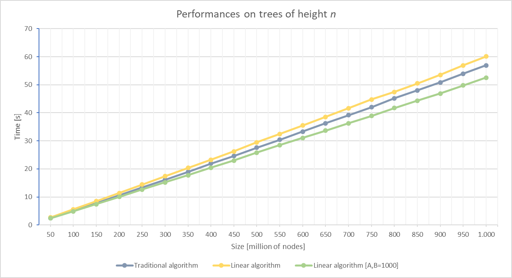

# A new linear-time algorithm for centroid decomposition

The centroid of a tree is a node that, when removed, breaks the tree in connected components of size at most half of that of the original tree. By recursing this procedure on the components, one obtains the centroid decomposition of the tree, also known as centroid tree. The centroid tree has logarithmic height and its construction is a powerful pre-processing step in several tree-processing algorithms. The folklore recursive algorithm for computing the centroid tree runs in `O(n*log(n))` time. To the best of our knowledge, the only result claiming `O(n)` time is unpublished and relies on (dynamic) heavy path decomposition of the original tree. In this repository, we include our implementation for the new linear-time algorithm that we proposed, based on the idea of applying the folklore algorithm to a suitable decomposition of the original tree.

# Installing

The main scripts are `cdstd.cpp` and `cdlin.cpp`, which are respectively the standard `O(n*log(n))` and our new `O(n)` algorithms for computing the centroid decomposition of a tree. We also provide the `benchmark.cpp` script that we used to measure the performance of our algorithm over the standard one, and some random tree generators, included in the `./tree_gen/` folder. To compile everything, just run `make all`.

# Implementation details

Both `T` and `T''` are internally represented with a `vector<uint32_t>`: each node of the two trees occupies a certain portion of this vector.

In `T`, the `i`-th node occupies the region `T[i], ..., T[j]`:
- `T[i]` is the number of `i`'s children, packed with a bitflag (MSB) saying if it is a cover element;
- `T[i+1]` is `i`'s parent;
- `T[i+2], ..., T[j]` are `i`'s children. Each one is represented by two integers `T[h], T[h+1]`:
    * `T[h]` is the child's ID;
    * `T[h+1]` is the weight of the subtree rooted at `T[h]`.

In `T''`, the `i`-th node occupies the region `T[i], ..., T[k]`:
- `T''[i]` is the number of `i`'s children;
- `T''[i+1]` is `i`'s parent;
- `T''[i+2]` is the size of the corresponding treelet on `T`;
- `T''[i+3]` is the ID of the root of the corresponding treelet on `T` (i.e. the alpha function);
- `T''[i+4], ..., T''[k]` are `i`'s children. Each one is represented by three integers `T''[h], ..., T''[h+2]`:
    * `T''[h]` is the child's ID;
    * `T''[h+1]` and `T''[h+2]` are the two deltas on the edge connecting `i` to `T[h]`.

# Performances

